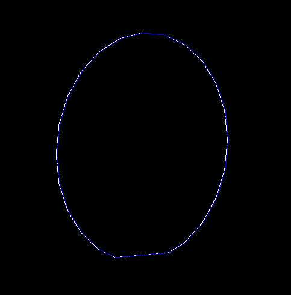

# Silicon Wafer Phonon Caustics with G4CMP

This repo is a modified version of the phonon caustic G4CMP example.

This project uses Geant4 and G4CMP to simulate ballistic phonon propagation through a silicon wafer. Phonons are emitted from a point source, transported through the crystal lattice, and recorded when they reach an aluminum sensor on the wafer surface.

## Simulation Geometry


The simulated geometry consists of:

- A circular silicon wafer (white) with a primary flat
- Wafer radius: `50 mm`
- Wafer thickness: `525 µm`
- Primary-flat length: `32.5 mm`
- Silicon crystal orientation: `(100)` with a `45°` rotation
- A aluminum phonon sensor (blue) covering the upper wafer surface
  
The sensor has approximately the same footprint as the silicon wafer and is positioned directly above its top surface.

The silicon–aluminum boundary is configured for complete phonon absorption. When a phonon reaches this boundary and is absorbed, the simulation records it as a detector hit.

## How Phonons are Spawned
Phonon generation is controlled by `Caustic.mac` and
`Caustic_PhononPrimaryGeneratorAction.cc`.

The default configuration generates:

- `40,000,000` primary phonons
- One phonon per event
- Phonon energy: `0.03 eV`
- Source position: `(0, 0, -0.262 mm)`
- Angular distribution: isotropic within `90° ≤ θ ≤ 180°`

The source is located near the face of the wafer away from the aluminum detector.

## Running the simulation

Building the example using cmake:
```
mkdir build
cd build
cmake ..
make
```

To run the simulation, go into the `build` folder and execute:
```
./g4cmpPhononCaustics Caustic.mac
```

The macro currently requests ten worker threads:
```
/run/numberOfThreads 10
```
Each thread may produce a separate hit file. These files can be combined with:
```
cat phonon_hits_G4WT*.txt > phonon_hits.txt
```

## Output Data

Each detected phonon produces one row containing six columns:
```
event_id  track_id  phonon_type  x  y  z
```
The position coordinates are written in meters.
Only phonons absorbed at the aluminum sensor boundary are written to the output file.

## Results
The hit positions are binned in the X–Y plane to produce a phonon-caustic intensity map. Regions with more hits correspond to crystal directions in which phonon energy is focused.

<table border="1">
  <!-- Row 1 -->
  <tr>
    <td>Slow</td>
    <td>Fast</td>
    <td>Long</td>
  </tr>
  
  <!-- Row 2 -->
  <tr>
    <td></td>
    <td></td>
    <td></td>
  </tr>
</table>
