# Silicon Wafer Phonon Caustics with G4CMP

This repository is a modified version of the G4CMP phonon-caustics example.

This project uses Geant4 and G4CMP to simulate ballistic phonon propagation through a silicon wafer. Phonons are transported through the crystal lattice and recorded when they reach an aluminum sensor on the wafer surface. The original point-source example has been extended to use a finite circular source and to study how changing the wafer thickness affects the observed caustic patterns.

## Changes Made (Aug 8, 2026)

- Replaced the original point source with a circular plane source of radius `0.1 mm`.
- Varied the wafer thickness to study its effect on the caustic pattern; the current geometry uses a `100 µm` wafer instead of the original `525 µm` wafer.

## Simulation Geometry


The simulated geometry consists of:

- A circular silicon wafer (white) with a primary flat
- Wafer radius: `50 mm`
- Wafer thickness: `525 µm` in the original configuration
- Primary-flat length: `32.5 mm`
- Silicon crystal orientation: `(100)` with a `45°` rotation
- An aluminum phonon sensor (blue) covering the upper wafer surface
  
The sensor has approximately the same footprint as the silicon wafer and is positioned directly above its top surface.

The silicon–aluminum boundary is configured for complete phonon absorption. When a phonon reaches this boundary and is absorbed, the simulation records it as a detector hit.

## How Phonons are Spawned
Phonon generation is controlled by `Caustic.mac` and
`Caustic_PhononPrimaryGeneratorAction.cc`.

The original configuration generates:

- `40,000,000` primary phonons
- One phonon per event
- Phonon energy: `0.03 eV`
- Source type: point source
- Source position: `(0, 0, -0.262 mm)`
- Angular distribution: isotropic within `90° ≤ θ ≤ 180°`

The phonons are generated on the side of the wafer opposite the aluminum detector.
The phonon type is selected in `src/Caustic_PhononPrimaryGeneratorAction.cc`.

## Running the simulation

Building the example using cmake:
```
mkdir build
cd build
cmake ..
make
```

To run the simulation, go into the `build` folder and execute:
```
./g4cmpPhononCaustics Caustic.mac
```

The macro currently requests ten worker threads:
```
/run/numberOfThreads 10
```
Each thread may produce a separate hit file. These files can be combined with:
```
cat phonon_hits_G4WT*.txt > phonon_hits.txt
```

## Output Data

Each detected phonon produces one row containing six columns:
```
event_id  track_id  phonon_type  x  y  z
```
The position coordinates are written in meters.
Only phonons absorbed at the aluminum sensor boundary are written to the output file.

## Results

The phonon hit positions are binned in the X–Y plane to generate phonon-caustic intensity maps. Regions with a higher density of hits indicate crystal directions where phonon energy is preferentially focused due to anisotropic propagation. All plot axes are given in meters and the color scale represents the number of detected phonons per bin.

### Original Point Source

These plots provide the reference result from the original point-source configuration.

<table>
<tr>
<td align="center">Transverse Slow</td>
<td align="center">Transverse Fast</td>
<td align="center">Longitudinal</td>
</tr>

<tr>
<td>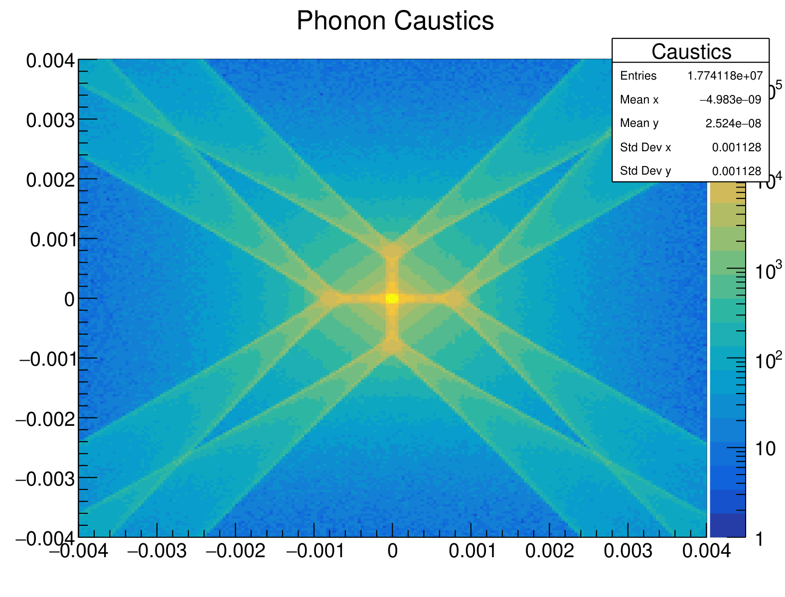</td>
<td>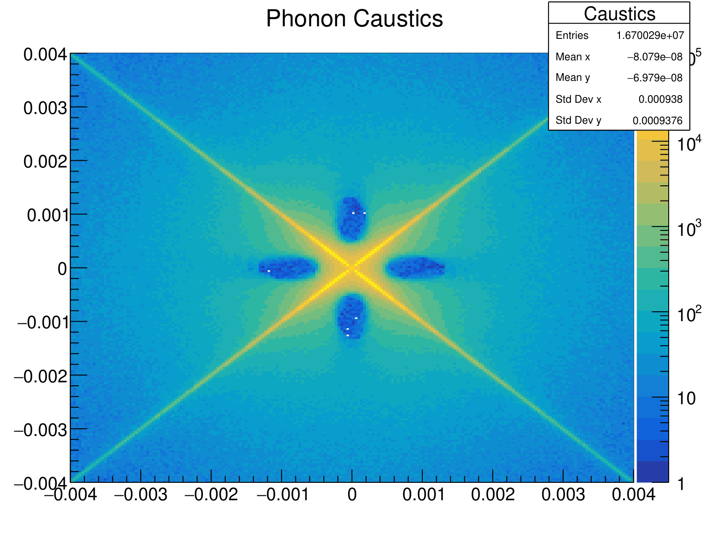</td>
<td>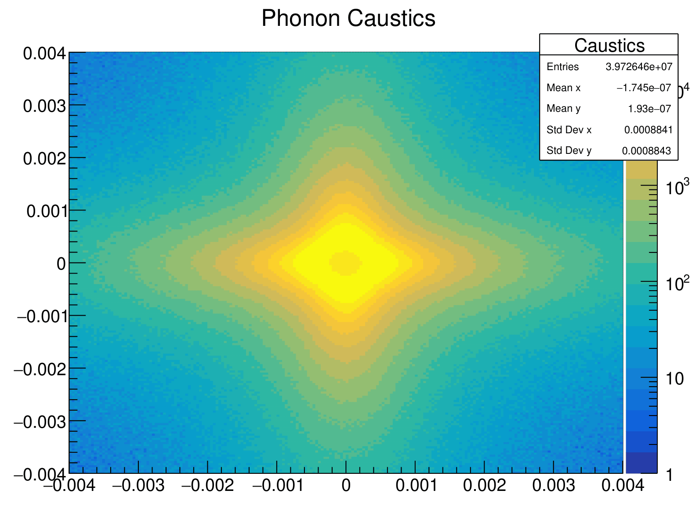</td>
</tr>
</table>

The transverse-slow and longitudinal modes show good qualitative agreement with the reference patterns. The transverse-fast mode also reproduces the main caustic features, although four unexpected low-intensity regions appear near the center of the distribution. The origin of these features has not yet been identified. To investigate whether the blue spots could be reduced or eliminated, two modifications were tested: replacing the point source with a circular source and varying the wafer dimensions. The results and observations from these tests are presented below.

### Circular Source

The point source was replaced by a circular source with some radius. Sampling the initial phonon positions across a finite area broadens the injection region while retaining the polarization-dependent caustic structure.

<table>
<tr>
<td align="center">Radius of source (mm)</td>
<td align="center">Transverse Slow</td>
<td align="center">Transverse Fast</td>
<td align="center">Longitudinal</td>
</tr>

<tr>
<td  align="center">0.1 mm</td>
<td>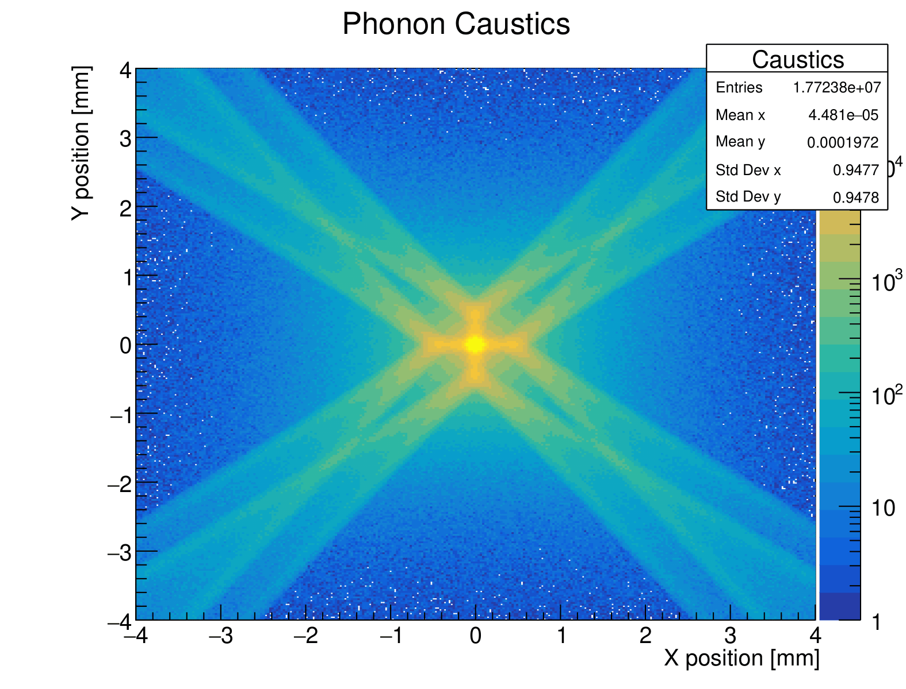</td>
<td>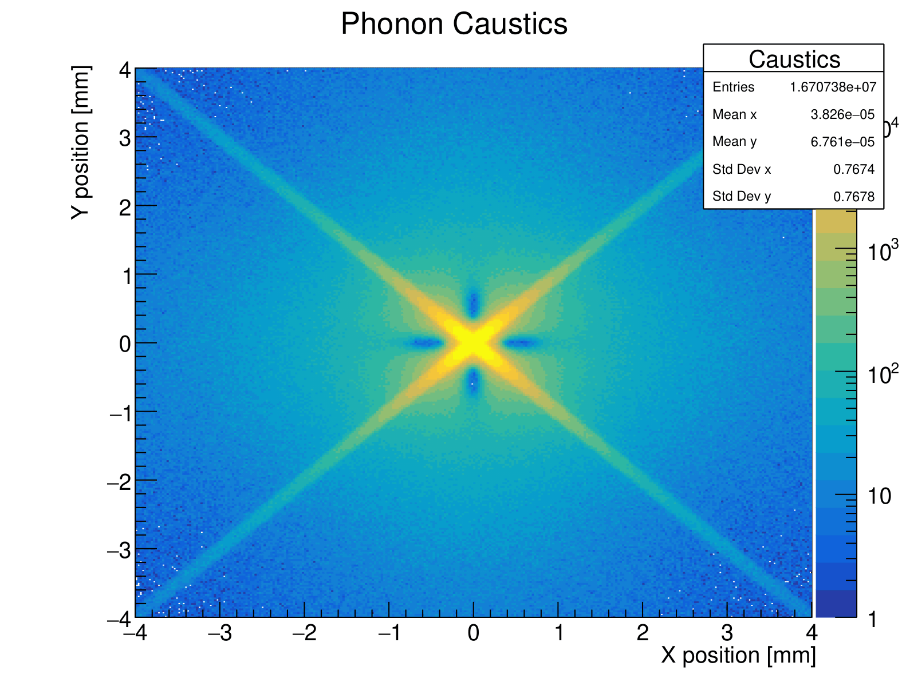</td>
<td>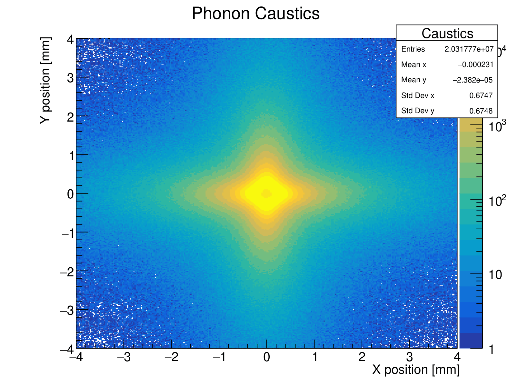</td>
</tr>

<tr>
<td  align="center">0.2 mm</td>
<td></td>
<td>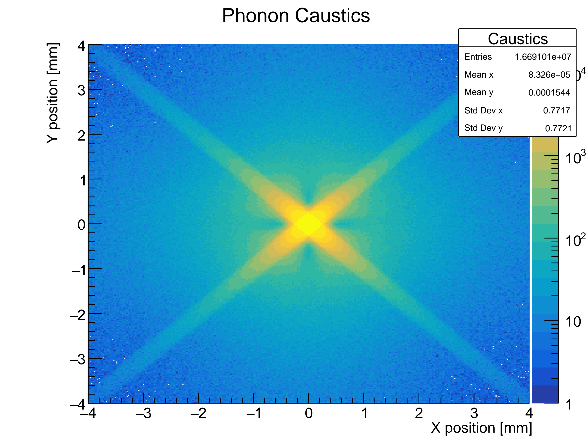</td>
<td>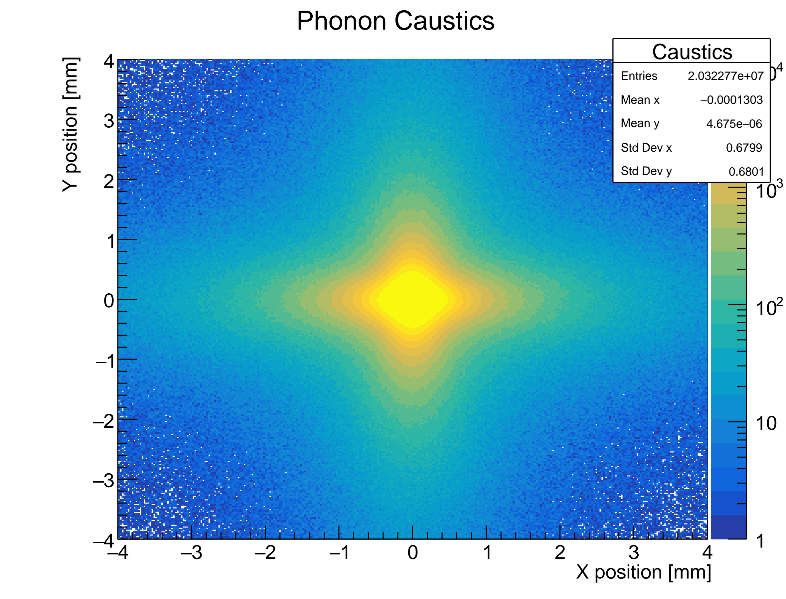</td>
</tr>

<tr>
<td  align="center">0.3 mm</td>
<td>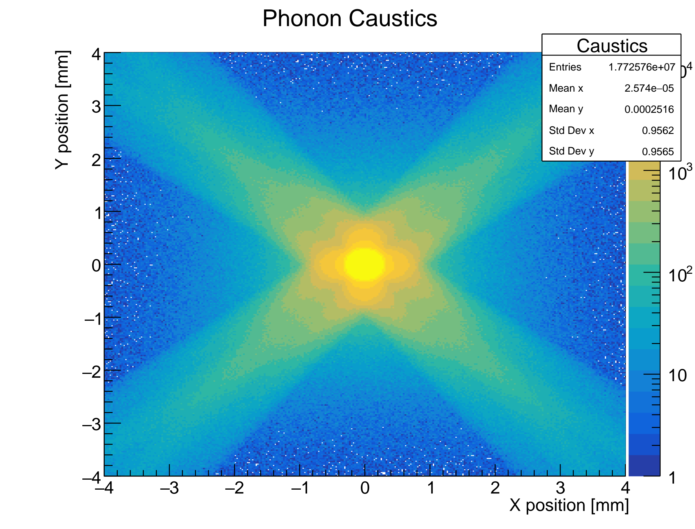</td>
<td></td>
<td></td>
</tr>

<tr>
<td  align="center">0.4 mm</td>
<td>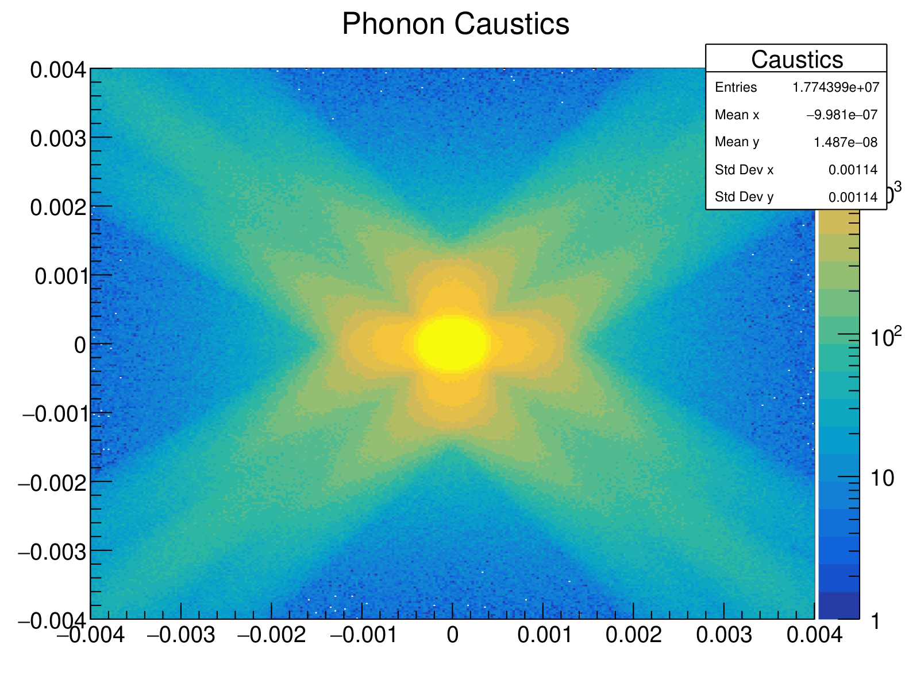</td>
<td>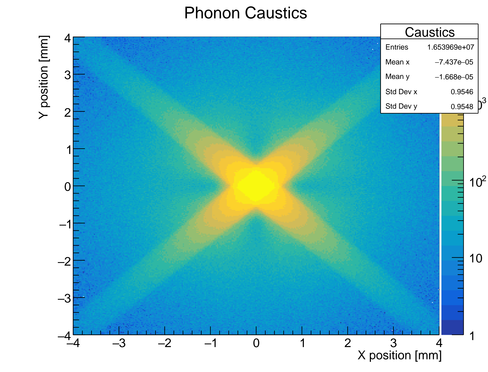</td>
<td>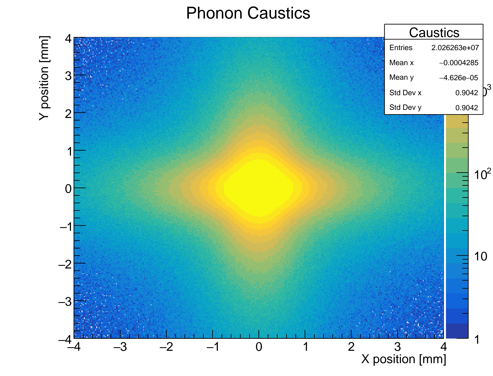</td>
</tr>
</table>

Compared with the point-source results, the circular source distributes phonons over a finite area, increasing the detected intensity in regions that were previously less populated. Since the phonons start from different positions across the source, the sharp features become smoother and broader. This effect depends on the source radius: smaller radii preserve more of the original caustic structure, while larger radii fill low-intensity regions more effectively but produce greater blurring and lower contrast.

### Varying the Wafer Thickness

The wafer thickness was also varied to change the propagation distance between the source and detector. The figure below uses a thickness of `100 µm`, and a circular source of radius `0.1 mm`.

<table>
<tr>
<td align="center">Transverse Slow</td>
<td align="center">Transverse Fast</td>
<td align="center">Longitudinal</td>
</tr>

<tr>
<td>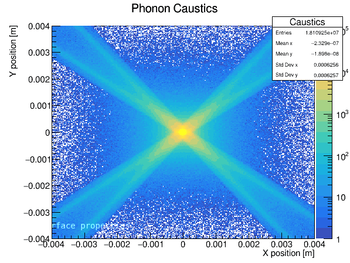</td>
<td>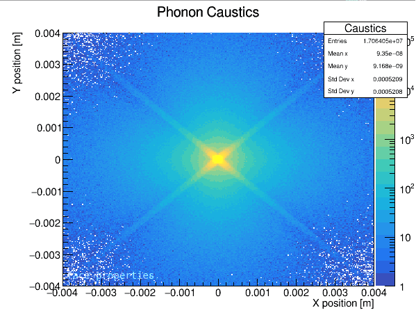</td>
<td>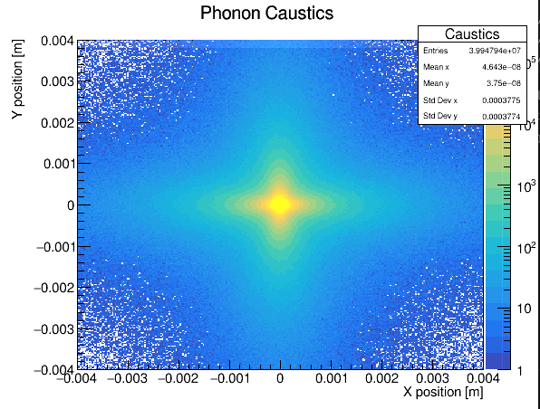</td>
</tr>
</table>

Reducing the wafer thickness brings the low-intensity regions closer to the source and makes them less prominent. However, I believe the shorter propagation distance is what causes the entire caustic pattern to become compressed toward the center, reducing the spatial separation between its characteristic features.


## Files of Interest

- `Caustic.mac` — Source, run, and physics configuration.
- `Caustics_Plots.C` — ROOT macro for generating phonon caustic intensity maps.
- `src/Caustic_PhononDetectorConstruction.cc` — Defines the silicon wafer, crystal orientation, and detector geometry.
- `src/Caustic_PhononPrimaryGeneratorAction.cc` — Configures the primary phonon source and polarization.
- `src/Caustic_PhononSensitivity.cc` — Records phonon hits on the detector surface.
- `images/` — Contains geometry visualizations and example phonon caustic results.
